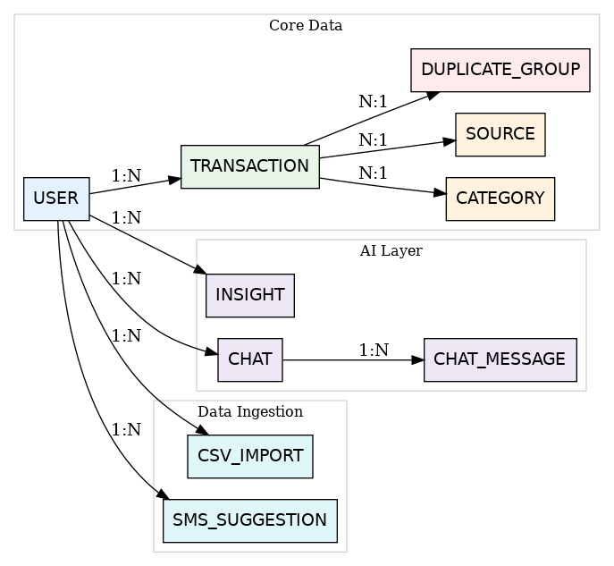

# 🟣 Zentra — AI-Powered Financial Insights Platform

> Understand Your Money. Make Smarter Decisions.

---

## 🚀 Project Status

- 🟡 Development Start Date: **1 June 2026**
- 🛠️ Current Phase: Planning & Architecture

---

## 🧩 Problem Statement

Managing personal finances is difficult due to:

- Fragmented transaction sources (cash, UPI, cards)
- Lack of meaningful insights
- High friction in manual tracking
- No intelligent financial assistant

---

## 🎯 Solution

Zentra is a hybrid financial intelligence platform that:

- Aggregates transactions from multiple sources  
- Minimizes manual effort using smart input  
- Provides AI-driven insights  
- Enables conversational financial queries  

---

## ✨ Features

### Core Features
- Add & manage transactions  
- View transaction history  
- Category-based filtering  

### Smart System
- Auto-categorization  
- Deduplication engine  
- Multi-source normalization  

### AI Features
- Monthly spending insights  
- Category breakdown  
- Overspending alerts  
- AI-powered chat assistant  

---

## 🏗️ Architecture

```text
Mobile App (React Native)   Web App (Next.js)
            ↓                     ↓
            -------- Backend (Node.js) --------
                           ↓
                    PostgreSQL Database
                           ↓
                     AI Insight Layer
```

---

## 🔄 Data Ingestion System

| Source | Purpose |
|--------|--------|
| Quick Add | Daily expenses (cash/manual) |
| CSV Upload | Bulk bank transaction import |
| SMS Parsing | Optional assisted detection |

---

## 📱 UI Screens

- Dashboard  
- Add Transaction  
- Transactions List  
- CSV Upload  
- SMS Suggestions  
- AI Chat  

---

## 🗄️ ER Diagram



---

## 🧠 Tech Stack

- Frontend: Next.js
- App: React Native
- Backend: Node.js (Express)  
- Database: PostgreSQL  
- AI: LLM API  
- DevOps: Docker, AWS

---

## ⚙️ Backend APIs

```http
POST   /transactions
GET    /transactions
POST   /upload-csv
POST   /insights
POST   /chat
```

---

## 🗄️ Database Design

Core Entities:

- Users  
- Transactions  
- Categories  
- Sources  
- Insights  
- Chats  
- CSV Imports  
- SMS Suggestions  

---

## 🧠 Key Design Principles

- Multi-source ingestion architecture  
- Confidence-based deduplication  
- Confirmation-driven SMS processing  
- Scalable relational schema  
- Future-ready for bank integration  

---

## 🐳 DevOps

- Dockerized services  
- AWS EC2 deployment  
- Future: AWS ECS + RDS  

---

## 📁 Project Structure

- backend/
- frontend/
- mobile/
- docs/

---

## 📦 Setup Instructions

### Clone Repo
```bash
git clone https://github.com/your-username/zentra-finance.git
cd zentra-finance
```

### Backend Setup
```bash
cd backend
npm install
npm run dev
```

### Database Setup
- Install PostgreSQL  
- Run schema SQL  

---

## 🧪 Development Roadmap

| Week | Focus |
|------|------|
| Week 1 | Backend + DB |
| Week 2 | Frontend |
| Week 3 | AI + Insights |
| Week 4 | Deployment |
| Week 5 | Mobile App |

---

## 📸 Preview

> Screenshots will be added soon.

---

## 🚀 Future Enhancements

- Bank integration (Account Aggregator)  
- Advanced analytics  
- Smart notifications  
- Full mobile app  

---

## 👨‍💻 Author

Ayush Kumar Agrawal  

🔗 [LinkedIn](https://www.linkedin.com/in/ayush-kumar-agrawal-376440303/)
